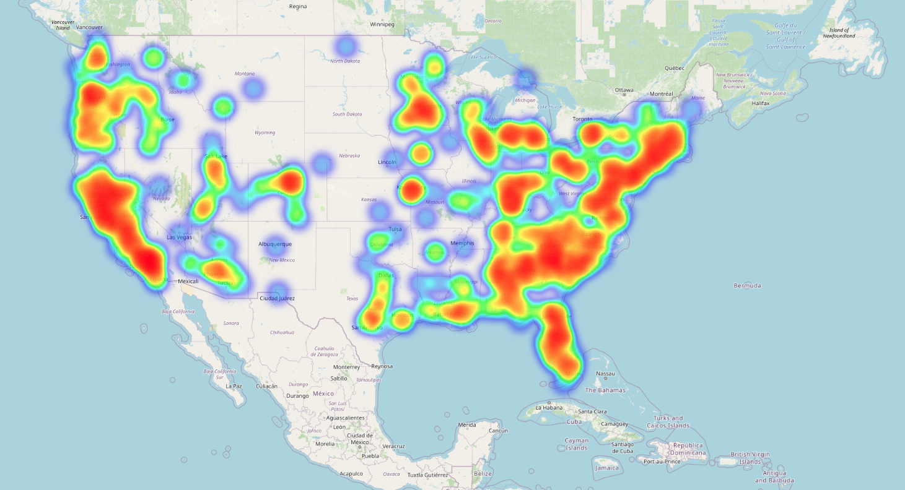

## us accidents

here, i try to analysis us accidents data.

The tools I used for this:
- python
- matplotlib
- seaborn

One visualization example given below.
- 
This image shows high rated geographical accident area.

I hope, you will enjoy my projects.thanks.
