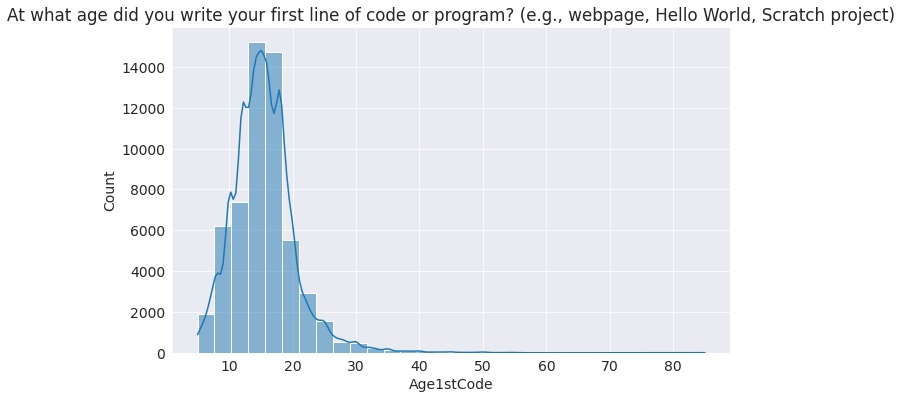

## stackoverflow survey

here, i try to analysis stackoverflow servey data.

The tools I used for this:
- python
- matplotlib
- seaborn

One visualization example given below.
- 

I hope, you will enjoy my projects.thanks.
